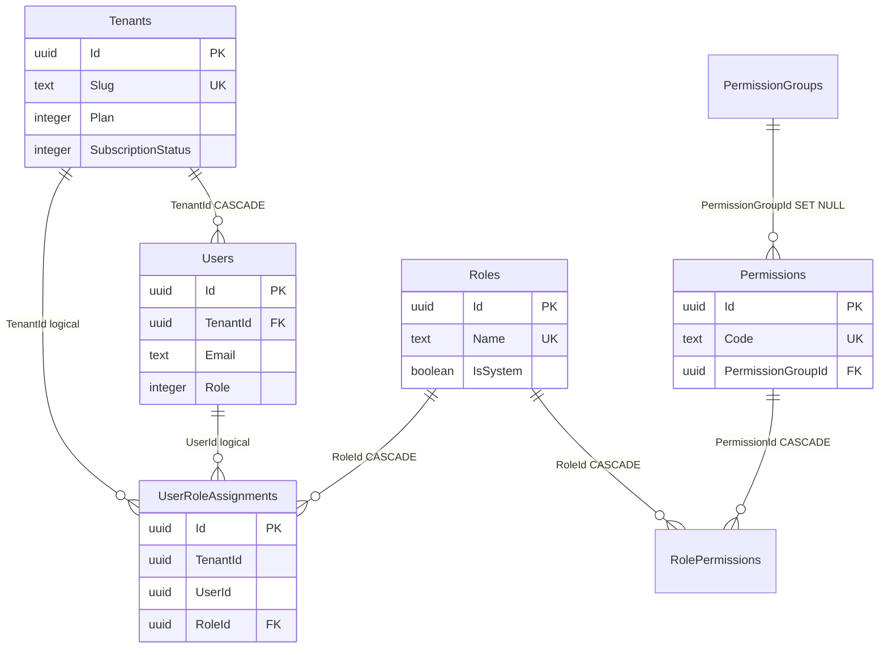
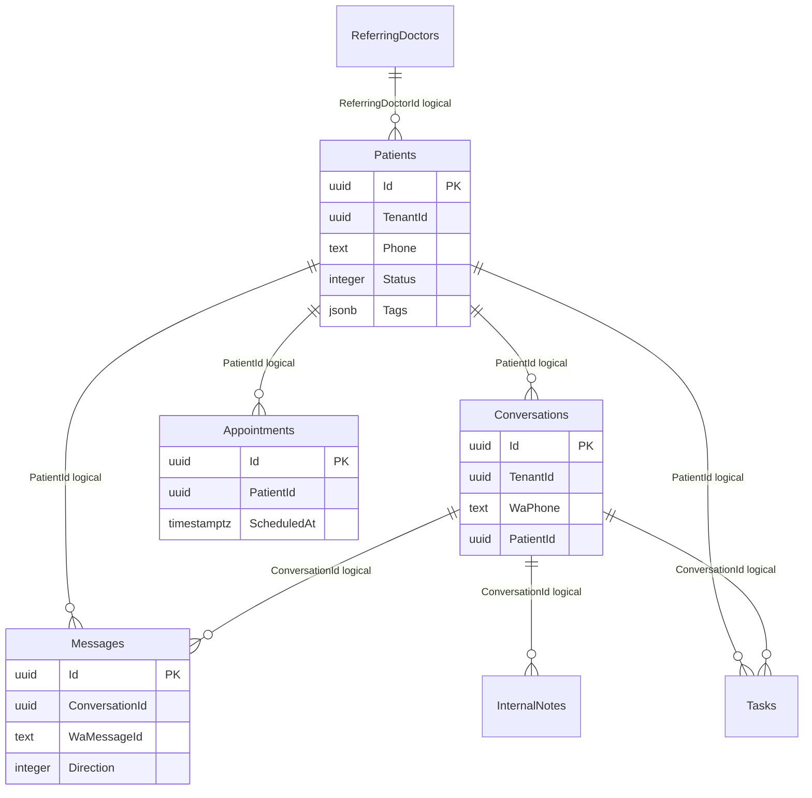
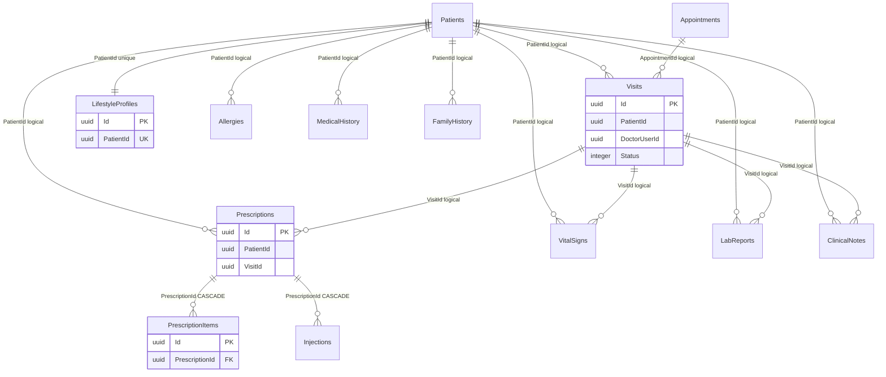
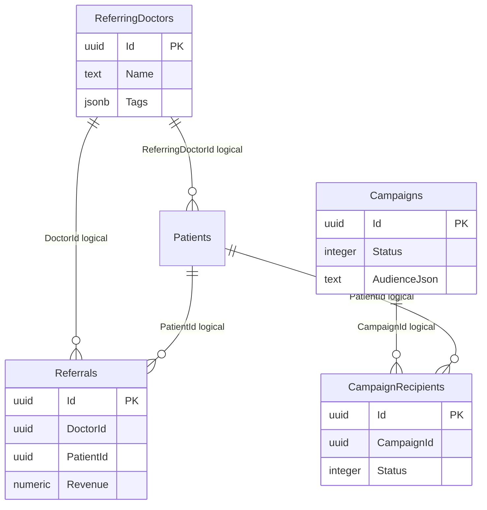
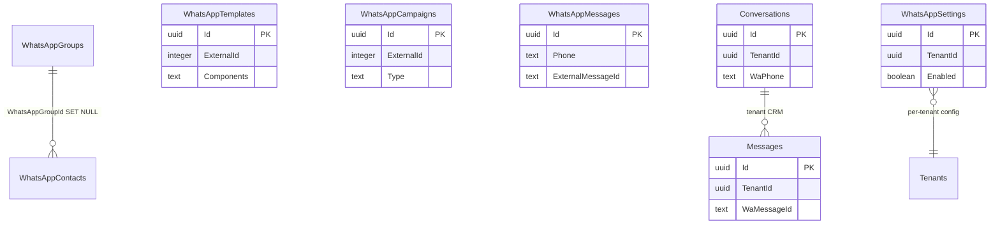

# Cure-Flow Database Architecture

> **Source of truth:** `ApplicationDbContext`, domain entities under `dotnet-backend/src/CureFlow.Domain/Entities/`, and migration `20260527113205_InitialCreate`.
>
> **Engine:** PostgreSQL via EF Core (`Npgsql.EntityFrameworkCore.PostgreSQL` 10.0.0)  
> **Tables:** 40  
> **Last verified:** 2026-05-27

---

## 1. Overview

Cure-Flow is a multi-tenant SaaS platform for hospital CRM, WhatsApp messaging, and lightweight EHR. All application data lives in a single PostgreSQL database accessed through `ApplicationDbContext`.

### 1.1 PostgreSQL & EF Core

| Aspect | Detail |
|--------|--------|
| Provider | Npgsql / PostgreSQL 14+ |
| Primary keys | `uuid` (`Guid`) |
| Timestamps | `timestamp with time zone` (`timestamptz`) — all `DateTime` values normalized to UTC on save |
| Time-of-day | `interval` (mapped from `TimeSpan`) |
| Money / decimals | `numeric` |
| Enums | Stored as PostgreSQL `integer` |
| JSON arrays | `jsonb` for `List<string>` (Patients.Tags, Conversations.Tags, ReferringDoctors.Tags, HospitalProfiles.Phones/Emails) |
| JSON blobs | `text` for serialized JSON (campaign audience, hospital profile sections, visit attachments, etc.) |

### 1.2 Multi-Tenancy

Tenancy is **shared-database, shared-schema** with a `TenantId` column on every `TenantEntity`.

- **`Tenant`** (`Tenants` table) is the hospital/account root. It inherits `BaseEntity` only — no `TenantId`.
- **`User`** and all operational data inherit **`TenantEntity`** and carry `TenantId`.
- On insert, `SaveChangesAsync` auto-populates `TenantId` from `ITenantContext` when it is still `Guid.Empty`.
- A global query filter scopes every `TenantEntity` query to the current tenant:

```csharp
!e.IsDeleted && e.TenantId == _tenant.TenantId
```

**Global (non-tenant) tables:** `Tenants`, RBAC reference tables (`PermissionGroups`, `Permissions`, `Roles`, `RolePermissions`), and WhatsApp API cache tables (`WhatsAppTemplates`, `WhatsAppGroups`, `WhatsAppCampaigns`, `WhatsAppContacts`, `WhatsAppMessages`).

### 1.3 Soft Delete

Every entity inherits `BaseEntity` with `IsDeleted` (default `false`). Deletes are logical, not physical.

- **`TenantEntity` filter:** `!IsDeleted && TenantId == current`
- **`BaseEntity` filter (non-tenant):** `!IsDeleted`

There is no `DeletedAt` / `DeletedBy` column; soft delete is a boolean flag only.

### 1.4 Audit Fields

All tables share these columns from `BaseEntity`:

| Column | Type | Notes |
|--------|------|-------|
| `Id` | `uuid` | PK, client-generated (`Guid.NewGuid()`) |
| `CreatedAt` | `timestamptz` | Set on insert |
| `UpdatedAt` | `timestamptz` | Set on insert and update |
| `CreatedBy` | `uuid` nullable | Set from `ITenantContext.UserId` on insert |
| `UpdatedBy` | `uuid` nullable | Set from `ITenantContext.UserId` on update |
| `IsActive` | `boolean` | Default `true`; not used by query filters |
| `IsDeleted` | `boolean` | Default `false`; drives soft-delete filter |

Tenant-scoped tables additionally have **`TenantId`** (`uuid`, required).

---

## 2. Entity Catalog (40 Tables)

Legend for repeated audit columns: **Audit** = `Id`, `CreatedAt`, `UpdatedAt`, `CreatedBy`, `UpdatedBy`, `IsActive`, `IsDeleted`. Tenant tables also include **`TenantId`**.

### 2.1 SaaS (2 tables)

#### `Tenants`

Hospital/account. **BaseEntity only** (no `TenantId`).

| Column | Type | Notes |
|--------|------|-------|
| Slug | `text` | Unique index `IX_Tenants_Slug` |
| Name | `text` | |
| ContactName | `text` nullable | |
| ContactEmail | `text` nullable | |
| ContactPhone | `text` nullable | |
| Country | `text` nullable | Default `"IN"` in entity |
| Timezone | `text` nullable | Default `"Asia/Kolkata"` |
| Plan | `integer` | `SubscriptionPlan` enum |
| SubscriptionStatus | `integer` | `SubscriptionStatus` enum |
| TrialEndsAt | `timestamptz` nullable | |
| SubscriptionRenewsAt | `timestamptz` nullable | |
| SeatLimit | `integer` | Default 5 |
| PatientLimit | `integer` | Default 500 |
| MessagesQuotaMonthly | `integer` | Default 1000 |
| **Audit** | | |

**FK:** `Users.TenantId → Tenants.Id` (CASCADE).

#### `Users`

Staff/doctor login accounts. **TenantEntity**.

| Column | Type | Notes |
|--------|------|-------|
| Name | `text` | |
| Email | `text` | Unique per tenant: `IX_Users_TenantId_Email` |
| PasswordHash | `text` | BCrypt |
| Role | `integer` | Legacy `UserRole` enum (parallel to RBAC) |
| Specialty | `text` nullable | Doctor fields |
| Qualifications | `text` nullable | |
| RegistrationNumber | `text` nullable | |
| Phone | `text` nullable | |
| ProfileImageUrl | `text` nullable | |
| Bio | `text` nullable | |
| LastLoginAt | `timestamptz` nullable | |
| **Audit + TenantId** | | |

---

### 2.2 RBAC (5 tables)

Global permission catalog with tenant-scoped role assignments. **No `TenantId`** on reference tables.

#### `PermissionGroups`

| Column | Type |
|--------|------|
| Name | `text` |
| Description | `text` nullable |
| **Audit** | |

#### `Permissions`

| Column | Type | Notes |
|--------|------|-------|
| Code | `text` | Unique `IX_Permissions_Code` |
| Name | `text` | |
| Description | `text` nullable | |
| PermissionGroupId | `uuid` nullable | FK → `PermissionGroups.Id` SET NULL |
| **Audit** | | |

#### `Roles`

| Column | Type | Notes |
|--------|------|-------|
| Name | `text` | Unique `IX_Roles_Name` |
| Description | `text` nullable | |
| IsSystem | `boolean` | |
| **Audit** | | |

#### `RolePermissions`

Join table. **Audit only** (no `TenantId`).

| Column | Type | Notes |
|--------|------|-------|
| RoleId | `uuid` | FK → `Roles.Id` CASCADE |
| PermissionId | `uuid` | FK → `Permissions.Id` CASCADE |
| **Audit** | | Unique `(RoleId, PermissionId)` |

#### `UserRoleAssignments`

**TenantEntity** — assigns a global role to a user within a tenant.

| Column | Type | Notes |
|--------|------|-------|
| UserId | `uuid` | Logical FK → `Users.Id` (no DB constraint) |
| RoleId | `uuid` | FK → `Roles.Id` CASCADE |
| **Audit + TenantId** | | Index `IX_UserRoleAssignments_TenantId_UserId` |

---

### 2.3 CRM (6 tables)

Patient intake, WhatsApp conversations, appointments, and tasks.

#### `Patients`

Central patient/lead record. **TenantEntity**.

| Column | Type | Notes |
|--------|------|-------|
| Name | `text` | |
| Phone | `text` | Index `(TenantId, Phone)` |
| Email | `text` nullable | |
| Age | `integer` nullable | |
| DateOfBirth | `timestamptz` nullable | |
| Gender | `integer` | `Gender` enum |
| BloodGroup | `integer` | `BloodGroup` enum |
| AddressLine1–2, City, State, Pincode | `text` nullable | |
| EmergencyContactName/Phone/Relation | `text` nullable | |
| Department | `text` nullable | |
| InquirySource | `text` | Default `"manual"` |
| ReferralDoctor | `text` nullable | Denormalized name |
| ReferringDoctorId | `uuid` nullable | Logical FK → `ReferringDoctors.Id` |
| AssignedStaffId | `uuid` nullable | Logical FK → `Users.Id` |
| Status | `integer` | `LeadStatus` enum; index `(TenantId, Status)` |
| Tags | `jsonb` | `List<string>` |
| Notes | `text` nullable | |
| LastContactAt | `timestamptz` nullable | |
| FollowUpDate | `timestamptz` nullable | |
| AiSummary | `text` nullable | |
| AiLeadScore | `integer` nullable | |
| GovIdType, GovIdNumber | `text` nullable | |
| Occupation, MaritalStatus | `text` nullable | |
| **Audit + TenantId** | | Index `(TenantId, CreatedAt)` |

#### `Conversations`

WhatsApp conversation threads. **TenantEntity**.

| Column | Type | Notes |
|--------|------|-------|
| PatientId | `uuid` nullable | Logical FK → `Patients.Id` |
| WaPhone | `text` | Index `(TenantId, WaPhone)` |
| Name | `text` nullable | |
| Category | `integer` | `ConversationCategory` |
| Priority | `integer` | `Priority` |
| AssignedStaffId | `uuid` nullable | |
| LastMessageAt | `timestamptz` | |
| LastMessagePreview | `text` nullable | |
| UnreadCount | `integer` | |
| Tags | `jsonb` | |
| AiSummary | `text` nullable | |
| AwaitingReplySince | `timestamptz` nullable | |
| Escalated | `boolean` | |
| **Audit + TenantId** | | Index `(TenantId, PatientId)` |

#### `Messages`

Individual WhatsApp messages. **TenantEntity**.

| Column | Type | Notes |
|--------|------|-------|
| ConversationId | `uuid` | Logical FK → `Conversations.Id`; index |
| PatientId | `uuid` nullable | |
| WaMessageId | `text` nullable | Index `IX_Messages_WaMessageId` |
| Direction | `integer` | `MessageDirection` |
| Type | `text` | e.g. `"text"` |
| Body | `text` | |
| MediaUrl, MimeType, Caption | `text` nullable | |
| Status | `integer` | `MessageStatus` |
| SenderUserId | `uuid` nullable | |
| **Audit + TenantId** | | Index `(TenantId, ConversationId)` |

#### `InternalNotes`

Staff notes on conversations (not sent to patient). **TenantEntity**.

| Column | Type |
|--------|------|
| ConversationId | `uuid` |
| AuthorId | `uuid` |
| AuthorName | `text` |
| Body | `text` |
| **Audit + TenantId** | |

#### `Appointments`

**TenantEntity**.

| Column | Type | Notes |
|--------|------|-------|
| PatientId | `uuid` | Denormalized PatientName, PatientPhone |
| DoctorUserId | `uuid` nullable | |
| DoctorName | `text` | |
| Department | `text` | |
| ScheduledAt | `timestamptz` | Index `(TenantId, ScheduledAt)` |
| DurationMinutes | `integer` | Default 15 |
| Status | `integer` | `AppointmentStatus`; index `(TenantId, Status, ScheduledAt)` |
| ChiefComplaint, Notes | `text` nullable | |
| ReminderSent, FollowUpSent | `boolean` | |
| CheckedInAt, CompletedAt | `timestamptz` nullable | |
| ConsultationFee | `numeric` nullable | |
| IsPaid | `boolean` | |
| **Audit + TenantId** | | Index `(TenantId, PatientId)` |

#### `Tasks`

Staff task queue (`TaskItem` entity). **TenantEntity**.

| Column | Type | Notes |
|--------|------|-------|
| Title | `text` | |
| Type | `integer` | `TaskType` |
| PatientId | `uuid` nullable | |
| PatientName | `text` nullable | |
| ConversationId | `uuid` nullable | |
| AssignedTo | `uuid` nullable | |
| Status | `integer` | `TaskStatus` |
| Priority | `integer` | `Priority` |
| DueAt | `timestamptz` nullable | |
| Notes | `text` nullable | |
| **Audit + TenantId** | | |

---

### 2.4 EHR + Visits (11 tables)

Clinical records anchored on `Patients` and optionally on `Visits` / `Appointments`.

#### `Visits`

Clinical encounter — central EHR anchor. **TenantEntity**.

| Column | Type | Notes |
|--------|------|-------|
| PatientId | `uuid` | Index `(TenantId, PatientId)` |
| AppointmentId | `uuid` nullable | |
| DoctorUserId | `uuid` | Index `(TenantId, DoctorUserId, VisitDate)` |
| DoctorName | `text` | |
| Department | `text` nullable | |
| VisitDate | `timestamptz` | |
| EndedAt | `timestamptz` nullable | |
| Status | `integer` | `VisitStatus`; index `(TenantId, Status, VisitDate)` |
| VisitType | `text` | Default `"outpatient"` |
| ChiefComplaint, Symptoms, Diagnosis | `text` nullable | |
| DoctorNotes, FollowUpAdvice | `text` nullable | |
| FollowUpDate | `timestamptz` nullable | |
| AttachmentsJson | `text` | JSON array metadata |
| **Audit + TenantId** | | |

#### `Allergies`

**TenantEntity**. Index `(TenantId, PatientId)`.

| Column | Type |
|--------|------|
| PatientId | `uuid` |
| Type | `integer` (`AllergyType`) |
| Allergen | `text` |
| Severity | `integer` (`AllergySeverity`) |
| Reaction | `text` nullable |
| FirstObserved | `timestamptz` nullable |
| Notes | `text` nullable |
| RecordedByUserId | `uuid` |
| RecordedByName | `text` nullable |
| **Audit + TenantId** | |

#### `Prescriptions`

**TenantEntity**. Index `(TenantId, PatientId)`.

| Column | Type |
|--------|------|
| PatientId | `uuid` |
| DoctorUserId | `uuid` |
| DoctorName | `text` |
| AppointmentId | `uuid` nullable |
| VisitId | `uuid` nullable |
| PrescribedAt | `timestamptz` |
| Diagnosis, ChiefComplaint, ClinicalNotes | `text` nullable |
| FollowUpAdvice | `text` nullable |
| NextVisitDate | `timestamptz` nullable |
| **Audit + TenantId** | |

#### `PrescriptionItems`

**TenantEntity**. FK `PrescriptionId → Prescriptions.Id` CASCADE.

| Column | Type |
|--------|------|
| PrescriptionId | `uuid` |
| DrugName | `text` |
| GenericName, Strength, Form | `text` nullable |
| Route | `integer` (`PrescriptionRouteType`) |
| Dosage, Frequency, Duration, Timing | `text` nullable |
| Quantity | `integer` nullable |
| ReasonForPrescribing | `text` |
| PossibleSideEffects, PatientInstructions | `text` nullable |
| IsContinuation, IsAcute | `boolean` |
| **Audit + TenantId** | |

#### `Injections`

**TenantEntity**. FK `PrescriptionId → Prescriptions.Id` CASCADE.

| Column | Type |
|--------|------|
| PrescriptionId | `uuid` |
| Name | `text` |
| GenericName, Strength, Site | `text` nullable |
| Route | `integer` (`PrescriptionRouteType`) |
| AdministeredAt | `timestamptz` |
| AdministeredByUserId | `uuid` nullable |
| AdministeredBy | `text` |
| BatchNumber | `text` nullable |
| ExpiryDate | `timestamptz` nullable |
| ReasonForInjection | `text` |
| AdverseReaction, Notes | `text` nullable |
| **Audit + TenantId** | |

#### `VitalSigns`

**TenantEntity**. Index `(TenantId, PatientId)`.

| Column | Type |
|--------|------|
| PatientId | `uuid` |
| AppointmentId, VisitId | `uuid` nullable |
| RecordedByUserId | `uuid` |
| RecordedByName | `text` nullable |
| MeasuredAt | `timestamptz` |
| HeightCm, WeightKg, Bmi | `numeric` nullable |
| SystolicBp, DiastolicBp, HeartRate | `integer` nullable |
| Temperature | `numeric` nullable |
| RespiratoryRate, OxygenSaturation | `integer` nullable |
| BloodSugarFasting, BloodSugarPostprandial, Hba1c | `numeric` nullable |
| Notes | `text` nullable |
| **Audit + TenantId** | |

#### `LabReports`

**TenantEntity**.

| Column | Type |
|--------|------|
| PatientId | `uuid` |
| AppointmentId, VisitId | `uuid` nullable |
| OrderedByUserId | `uuid` nullable |
| TestName | `text` |
| Category, LabName | `text` nullable |
| SampleCollectedAt, ReportedAt | `timestamptz` nullable |
| Results, Interpretation, FileUrl | `text` nullable |
| IsAbnormal | `boolean` |
| **Audit + TenantId** | |

#### `ClinicalNotes`

SOAP notes. **TenantEntity**. Index `(TenantId, PatientId)`.

| Column | Type |
|--------|------|
| PatientId | `uuid` |
| AppointmentId, VisitId | `uuid` nullable |
| AuthorUserId | `uuid` |
| AuthorName | `text` |
| NoteType | `text` | Default `"progress"` |
| Subjective, Objective, Assessment, Plan | `text` |
| **Audit + TenantId** | |

#### `MedicalHistory`

Past conditions (`MedicalHistoryItem`). **TenantEntity**.

| Column | Type |
|--------|------|
| PatientId | `uuid` |
| Category | `text` | Default `"condition"` |
| Title | `text` |
| OnsetDate | `timestamptz` nullable |
| IsOngoing | `boolean` |
| Description | `text` nullable |
| **Audit + TenantId** | |

#### `FamilyHistory`

Hereditary history (`FamilyHistoryItem`). **TenantEntity**.

| Column | Type |
|--------|------|
| PatientId | `uuid` |
| Relation | `text` |
| Condition | `text` |
| AgeOfOnset | `integer` nullable |
| Notes | `text` nullable |
| **Audit + TenantId** | |

#### `LifestyleProfiles`

One-to-one with patient. **TenantEntity**. Unique `(TenantId, PatientId)`.

| Column | Type |
|--------|------|
| PatientId | `uuid` |
| AverageSleepHours | `numeric` nullable |
| SleepQuality | `text` nullable |
| WakeUpTime, BedTime | `interval` nullable |
| WaterIntakeLitersPerDay | `numeric` nullable |
| MealsPerDay | `integer` nullable |
| MealTimings | `text` nullable |
| SkipsBreakfast | `boolean` |
| DietType, CuisinePreferences, FoodAllergiesText, DietaryRestrictions | `text` nullable |
| CaffeineCupsPerDay | `numeric` nullable |
| ConsumesProcessedFood, ConsumesSugaryDrinks | `boolean` |
| ExercisesRegularly | `boolean` |
| ExerciseMinutesPerWeek | `integer` nullable |
| ExerciseType, PhysicalActivityLevel | `text` nullable |
| SmokingStatus | `integer` (`SmokingStatus`) |
| CigarettesPerDay, YearsOfSmoking | `integer` nullable |
| AlcoholConsumption | `integer` (`AlcoholConsumption`) |
| AlcoholDetails | `text` nullable |
| ChewsTobaccoOrPaan | `boolean` |
| OtherSubstances | `text` nullable |
| Occupation, WorkSchedule | `text` nullable |
| WorkHoursPerDay | `integer` nullable |
| HighStressJob | `boolean` |
| StressLevel, StressManagementMethods, HobbiesAndInterests | `text` nullable |
| MentalHealthConcerns | `text` nullable |
| HasAnxietyOrDepression | `boolean` nullable |
| CurrentMentalHealthTreatment | `text` nullable |
| MenstrualCycleStatus, LastMenstrualPeriod, ContraceptiveUse | `text` nullable |
| NumberOfPregnancies | `integer` nullable |
| LivingEnvironment, PetExposure | `text` nullable |
| ExposureToPollution | `boolean` |
| AdditionalLifestyleNotes | `text` nullable |
| LastUpdatedAt | `timestamptz` |
| LastUpdatedByUserId | `uuid` nullable |
| **Audit + TenantId** | |

---

### 2.5 Staff (2 tables)

#### `StaffProfiles`

Extended profile for internal staff. **TenantEntity**. Unique `(TenantId, UserId)`.

| Column | Type | Notes |
|--------|------|-------|
| UserId | `uuid` | FK → `Users.Id` CASCADE |
| Department, Specialization, Qualification | `text` nullable | |
| ConsultationFee | `numeric` nullable | |
| Shift, WardAssignment | `text` nullable | |
| IsAvailable | `boolean` | |
| **Audit + TenantId** | | |

#### `DoctorSchedules`

Weekly or one-off availability. **TenantEntity**.

| Column | Type | Notes |
|--------|------|-------|
| StaffProfileId | `uuid` | FK → `StaffProfiles.Id` CASCADE |
| DayOfWeek | `integer` nullable | 0=Sun … 6=Sat |
| SpecificDate | `timestamptz` nullable | Override date |
| StartTime, EndTime | `interval` | |
| IsAvailable | `boolean` | |
| Notes | `text` nullable | |
| **Audit + TenantId** | | |

---

### 2.6 Referrals & Campaigns (4 tables)

#### `ReferringDoctors`

External referring physicians (not system users). **TenantEntity**.

| Column | Type |
|--------|------|
| Name | `text` |
| Clinic, Specialty | `text` nullable |
| Phone, Email | `text` nullable |
| Category | `integer` (`DoctorCategory`) |
| Tags | `jsonb` |
| Notes | `text` nullable |
| ReconnectEveryDays | `integer` | Default 30 |
| LastContactAt | `timestamptz` nullable |
| **Audit + TenantId** | |

#### `Referrals`

Tracked referral revenue. **TenantEntity**.

| Column | Type |
|--------|------|
| DoctorId | `uuid` | Logical FK → `ReferringDoctors.Id` |
| DoctorName | `text` | Denormalized |
| PatientId | `uuid` | Logical FK → `Patients.Id` |
| PatientName | `text` | Denormalized |
| Revenue | `numeric` | |
| Notes | `text` nullable |
| **Audit + TenantId** | |

#### `Campaigns`

In-app WhatsApp broadcast campaigns. **TenantEntity**.

| Column | Type |
|--------|------|
| Name | `text` |
| Description | `text` nullable |
| MessageBody | `text` |
| AudienceJson | `text` | Serialized audience filter |
| Status | `integer` (`CampaignStatus`) |
| ScheduledAt, SentAt | `timestamptz` nullable |
| CreatedByUserId | `uuid` nullable |
| TotalRecipients, SentCount, DeliveredCount, ReadCount, RepliedCount, FailedCount | `integer` |
| **Audit + TenantId** | |

#### `CampaignRecipients`

Per-patient campaign delivery tracking. **TenantEntity**.

| Column | Type |
|--------|------|
| CampaignId | `uuid` | Logical FK → `Campaigns.Id` |
| PatientId | `uuid` | |
| PatientName, PatientPhone | `text` | Denormalized |
| Status | `integer` (`RecipientStatus`) |
| WaMessageId | `text` nullable | |
| SentAt, RepliedAt | `timestamptz` nullable |
| **Audit + TenantId** | |

---

### 2.7 System (5 tables)

#### `HospitalProfiles`

Public-facing hospital info (AI / WhatsApp context). **TenantEntity**. Unique `TenantId`.

| Column | Type |
|--------|------|
| Name | `text` |
| Tagline, About, Address, Website, WorkingHours | `text` nullable |
| Phones, Emails | `jsonb` |
| Emergency24x7 | `boolean` |
| DepartmentsJson, ServicesJson, DoctorsJson, PackagesJson, FaqsJson | `text` |
| **Audit + TenantId** | |

#### `Templates`

Quick-reply message templates (`QuickTemplate`). **TenantEntity**.

| Column | Type |
|--------|------|
| Name | `text` |
| Body | `text` |
| Category | `text` | Default `"general"` |
| **Audit + TenantId** | |

#### `AuditLogs`

User action audit trail. **TenantEntity**.

| Column | Type |
|--------|------|
| UserId | `uuid` nullable |
| UserName | `text` nullable |
| Action | `text` |
| EntityType, EntityId | `text` nullable |
| MetadataJson | `text` | Default `"{}"` |
| **Audit + TenantId** | |

#### `WhatsAppSettings`

Per-tenant Meta WhatsApp Business API credentials. **TenantEntity**.

| Column | Type |
|--------|------|
| PhoneNumberId, WabaId | `text` nullable |
| AccessTokenEncrypted, AppSecretEncrypted | `text` nullable |
| VerifyToken | `text` nullable |
| BusinessName | `text` |
| Enabled | `boolean` |
| **Audit + TenantId** | |

#### `IntegrationEvents`

Outbox-style integration events. **TenantEntity**.

| Column | Type |
|--------|------|
| EventType | `text` |
| EntityType, EntityId | `text` nullable |
| PayloadJson | `text` |
| Processed | `boolean` |
| **Audit + TenantId** | |

---

### 2.8 WhatsApp API Cache (5 tables)

Read-through cache of external WhatsBiz / WhatsApp API data. **BaseEntity only** — global, not tenant-scoped. Soft-delete filter applies; no tenant filter.

#### `WhatsAppTemplates`

| Column | Type |
|--------|------|
| Name, Status, Category, Language | `text` |
| Components | `text` | JSON |
| ExternalId | `integer` |
| ExternalCreatedAt, ExternalUpdatedAt | `timestamptz` |
| CachedAt | `timestamptz` |
| **Audit** | |

#### `WhatsAppGroups`

| Column | Type |
|--------|------|
| Name | `text` |
| ExternalId | `integer` |
| ExternalDeletedAt | `timestamptz` nullable |
| ExternalCreatedAt, ExternalUpdatedAt | `timestamptz` |
| CachedAt | `timestamptz` |
| **Audit** | |

#### `WhatsAppCampaigns`

| Column | Type |
|--------|------|
| Name | `text` |
| Type | `text` | bot / api / regular |
| Status | `text` |
| ExternalId | `integer` |
| ExternalDeletedAt | `timestamptz` nullable |
| ExternalCreatedAt, ExternalUpdatedAt | `timestamptz` |
| CachedAt | `timestamptz` |
| **Audit** | |

#### `WhatsAppContacts`

| Column | Type | Notes |
|--------|------|-------|
| Phone | `text` | |
| Name | `text` | |
| ExternalGroupId | `varchar(64)` | WhatsBiz group id (not EF FK) |
| WhatsAppGroupId | `uuid` nullable | FK → `WhatsAppGroups.Id` SET NULL |
| CustomFields | `text` nullable | JSON |
| ExternalId | `text` | |
| ExternalCreatedAt, ExternalUpdatedAt | `timestamptz` |
| CachedAt | `timestamptz` |
| **Audit** | | |

#### `WhatsAppMessages`

Outbound message log from external API. **Audit only**.

| Column | Type |
|--------|------|
| Phone | `text` |
| MessageType | `text` |
| Content | `text` |
| Status | `text` |
| ExternalMessageId | `text` nullable |
| ErrorMessage | `text` nullable |
| SentAt | `timestamptz` |
| DeliveredAt, ReadAt | `timestamptz` nullable |
| **Audit** | |

---

## 3. Entity-Relationship Diagrams

### 3.1 Tenancy & RBAC



### 3.2 CRM (Patients & Conversations)



### 3.3 EHR & Visits



### 3.4 Referrals & Campaigns



### 3.5 WhatsApp Dual Stores

Cure-Flow maintains **two parallel WhatsApp data layers**:

1. **Tenant CRM store** — live patient conversations (`Conversations`, `Messages`, `WhatsAppSettings`).
2. **Global API cache** — synced external WhatsBiz/Meta resources (no `TenantId`).



---

## 4. Relationship Matrix

| From | Column | To | DB FK | Delete | Notes |
|------|--------|-----|-------|--------|-------|
| Users | TenantId | Tenants.Id | Yes | CASCADE | Only tenant hierarchy FK |
| Permissions | PermissionGroupId | PermissionGroups.Id | Yes | SET NULL | |
| RolePermissions | RoleId | Roles.Id | Yes | CASCADE | |
| RolePermissions | PermissionId | Permissions.Id | Yes | CASCADE | Unique pair |
| UserRoleAssignments | RoleId | Roles.Id | Yes | CASCADE | UserId has no DB FK |
| StaffProfiles | UserId | Users.Id | Yes | CASCADE | Unique per tenant |
| DoctorSchedules | StaffProfileId | StaffProfiles.Id | Yes | CASCADE | |
| PrescriptionItems | PrescriptionId | Prescriptions.Id | Yes | CASCADE | |
| Injections | PrescriptionId | Prescriptions.Id | Yes | CASCADE | |
| WhatsAppContacts | WhatsAppGroupId | WhatsAppGroups.Id | Yes | SET NULL | |
| Patients | ReferringDoctorId | ReferringDoctors.Id | No | — | Application-level |
| Conversations | PatientId | Patients.Id | No | — | |
| Messages | ConversationId | Conversations.Id | No | — | Indexed |
| InternalNotes | ConversationId | Conversations.Id | No | — | |
| Appointments | PatientId | Patients.Id | No | — | Denormalized names |
| Tasks | PatientId, ConversationId | Patients, Conversations | No | — | |
| Visits | PatientId, AppointmentId | Patients, Appointments | No | — | |
| All EHR child tables | PatientId | Patients.Id | No | — | |
| EHR encounter tables | VisitId, AppointmentId | Visits, Appointments | No | — | Optional linkage |
| Referrals | DoctorId, PatientId | ReferringDoctors, Patients | No | — | Denormalized names |
| CampaignRecipients | CampaignId, PatientId | Campaigns, Patients | No | — | |
| UserRoleAssignments | UserId | Users.Id | No | — | Tenant-scoped |
| All `*UserId` columns | — | Users.Id | No | — | Doctor, author, recorder refs |

**Summary:** Only **9 foreign-key constraints** exist in the database. The majority of relationships are **logical GUID references** enforced in application code, with denormalized name/phone fields for display and historical accuracy.

---

## 5. Query Filters & Special Behavior

### 5.1 Global Query Filters

Applied automatically in `ApplicationDbContext.OnModelCreating`:

| Entity base | Filter expression |
|-------------|-------------------|
| `TenantEntity` | `!IsDeleted && TenantId == _tenant.TenantId` |
| `BaseEntity` (non-tenant) | `!IsDeleted` |

`Tenant` uses the soft-delete filter only (it is `BaseEntity`, not `TenantEntity`).

When `ITenantContext.TenantId` is `Guid.Empty`, the tenant filter matches **no tenant rows** (safe default). Seeders and auth flows bypass this with `.IgnoreQueryFilters()`.

### 5.2 SaveChanges Behavior

On every save:

1. **Audit timestamps** — `CreatedAt` / `UpdatedAt` set to `DateTime.UtcNow`.
2. **Audit users** — `CreatedBy` / `UpdatedBy` from `ITenantContext.UserId` when available.
3. **Auto TenantId** — new `TenantEntity` rows get `TenantId` from context if still empty.
4. **UTC normalization** — all `DateTime` / `DateTime?` properties converted to UTC before persist.

### 5.3 IgnoreQueryFilters Usage

Bypass global filters when tenant context is unavailable or cross-tenant/system operations are required:

| Location | Entities | Reason |
|----------|----------|--------|
| `AuthService` | Users, Tenants | Login/registration before tenant is resolved |
| `TenantMiddleware` | Users | Resolve tenant from authenticated user |
| `UserPermissionService` | UserRoleAssignments, Roles, RolePermissions, Permissions | RBAC is global; assignments filtered by tenant in query |
| `RbacSeeder` | PermissionGroups, Permissions, Roles, RolePermissions | Idempotent global seed |
| `DemoSeeder` | Tenants, Users, StaffProfiles, Patients, Conversations, Templates, HospitalProfiles, ReferringDoctors, Visits, VitalSigns, ClinicalNotes, Prescriptions, UserRoleAssignments, Roles | Bootstrap demo tenant |
| `WhatsappWebhookProcessor` | Tenants | Resolve tenant from webhook metadata |
| `WhatsappConversationHelper` | Conversations, Messages | Cross-tenant normalization / orphan cleanup |
| `WhatsappConversationNormalizationHostedService` | Tenants | Default tenant lookup |
| `WhatsappApiService` | Tenants | Tenant resolution |
| `SchedulerHostedService` | Tenants | Background jobs across all active tenants |

### 5.4 Indexes (Performance-Critical)

| Index | Table | Purpose |
|-------|-------|---------|
| `IX_Tenants_Slug` (unique) | Tenants | Subdomain routing |
| `IX_Users_TenantId_Email` (unique) | Users | Login uniqueness |
| `IX_Patients_TenantId_Phone` | Patients | Phone lookup |
| `IX_Patients_TenantId_Status` | Patients | Lead pipeline |
| `IX_Conversations_TenantId_WaPhone` | Conversations | WhatsApp thread lookup |
| `IX_Messages_WaMessageId` | Messages | Webhook deduplication |
| `IX_Appointments_TenantId_Status_ScheduledAt` | Appointments | Calendar views |
| `IX_Visits_TenantId_DoctorUserId_VisitDate` | Visits | Doctor schedule |
| `IX_LifestyleProfiles_TenantId_PatientId` (unique) | LifestyleProfiles | 1:1 enforcement |
| `IX_HospitalProfiles_TenantId` (unique) | HospitalProfiles | One profile per tenant |
| `IX_StaffProfiles_TenantId_UserId` (unique) | StaffProfiles | One profile per user |
| `IX_Permissions_Code` (unique) | Permissions | Permission checks |
| `IX_Roles_Name` (unique) | Roles | Role lookup |
| `IX_RolePermissions_RoleId_PermissionId` (unique) | RolePermissions | No duplicate grants |

---

## 6. Notable Design Decisions & Gaps

### Decisions

1. **Shared-schema multi-tenancy** — Simple ops model; all isolation via `TenantId` + EF query filters.
2. **Denormalized display fields** — `PatientName`, `DoctorName`, etc. preserved at write time so historical records stay readable if master data changes.
3. **Dual RBAC** — Legacy `User.Role` enum coexists with granular `Roles` / `Permissions` / `UserRoleAssignments`. Authorization service reads RBAC tables; enum may still be used in UI/legacy paths.
4. **Visit as EHR hub** — Optional `VisitId` / `AppointmentId` on clinical artifacts allows records outside a formal visit.
5. **JSON-in-text columns** — Hospital profile sections, campaign audience, attachments use `text` JSON rather than `jsonb`; only tag arrays use native `jsonb`.
6. **WhatsApp dual stores** — Tenant CRM messages (`Messages`) are separate from external API cache (`WhatsAppMessages`); no FK between them.
7. **Minimal DB constraints** — Only critical hierarchies (user→tenant, prescription lines, staff profile, RBAC joins) have FKs; CRM/EHR links are application-enforced for migration flexibility.

### Known Gaps / Risks

| Gap | Impact |
|-----|--------|
| No FK from CRM/EHR tables to `Patients` | Orphan rows possible if patient hard-deleted outside app |
| No FK on `UserRoleAssignments.UserId` | Orphan assignments if user removed incorrectly |
| Soft delete only (`IsDeleted`) | No deleted timestamp; hard to audit purge timing |
| `IsActive` not in query filters | Inactive rows still returned unless filtered in services |
| WhatsApp cache tables are global | Shared across tenants; `ExternalGroupId` is not tenant-scoped |
| `Campaigns` vs `WhatsAppCampaigns` | Same domain name, different tables — easy to confuse |
| No row-level security in PostgreSQL | Tenant isolation relies entirely on EF filters + app discipline |
| `IntegrationEvents.Processed` | No retry/dead-letter columns beyond boolean flag |

---

## 7. Appendix: Complete Table Index

| # | Table | Entity class | Base type | Domain |
|---|-------|--------------|-----------|--------|
| 1 | Allergies | `Allergy` | TenantEntity | EHR |
| 2 | Appointments | `Appointment` | TenantEntity | CRM |
| 3 | AuditLogs | `AuditLog` | TenantEntity | System |
| 4 | CampaignRecipients | `CampaignRecipient` | TenantEntity | Referrals |
| 5 | Campaigns | `Campaign` | TenantEntity | Referrals |
| 6 | ClinicalNotes | `ClinicalNote` | TenantEntity | EHR |
| 7 | Conversations | `Conversation` | TenantEntity | CRM |
| 8 | DoctorSchedules | `DoctorSchedule` | TenantEntity | Staff |
| 9 | FamilyHistory | `FamilyHistoryItem` | TenantEntity | EHR |
| 10 | HospitalProfiles | `HospitalProfile` | TenantEntity | System |
| 11 | Injections | `Injection` | TenantEntity | EHR |
| 12 | IntegrationEvents | `IntegrationEvent` | TenantEntity | System |
| 13 | InternalNotes | `InternalNote` | TenantEntity | CRM |
| 14 | LabReports | `LabReport` | TenantEntity | EHR |
| 15 | LifestyleProfiles | `LifestyleProfile` | TenantEntity | EHR |
| 16 | MedicalHistory | `MedicalHistoryItem` | TenantEntity | EHR |
| 17 | Messages | `Message` | TenantEntity | CRM |
| 18 | Patients | `Patient` | TenantEntity | CRM |
| 19 | PermissionGroups | `PermissionGroup` | BaseEntity | RBAC |
| 20 | Permissions | `Permission` | BaseEntity | RBAC |
| 21 | PrescriptionItems | `PrescriptionItem` | TenantEntity | EHR |
| 22 | Prescriptions | `Prescription` | TenantEntity | EHR |
| 23 | Referrals | `Referral` | TenantEntity | Referrals |
| 24 | ReferringDoctors | `ReferringDoctor` | TenantEntity | Referrals |
| 25 | RolePermissions | `RolePermission` | BaseEntity | RBAC |
| 26 | Roles | `Role` | BaseEntity | RBAC |
| 27 | StaffProfiles | `StaffProfile` | TenantEntity | Staff |
| 28 | Tasks | `TaskItem` | TenantEntity | CRM |
| 29 | Templates | `QuickTemplate` | TenantEntity | System |
| 30 | Tenants | `Tenant` | BaseEntity | SaaS |
| 31 | UserRoleAssignments | `UserRoleAssignment` | TenantEntity | RBAC |
| 32 | Users | `User` | TenantEntity | SaaS |
| 33 | Visits | `Visit` | TenantEntity | EHR |
| 34 | VitalSigns | `VitalSigns` | TenantEntity | EHR |
| 35 | WhatsAppCampaigns | `WhatsAppCampaign` | BaseEntity | WhatsApp cache |
| 36 | WhatsAppContacts | `WhatsAppContact` | BaseEntity | WhatsApp cache |
| 37 | WhatsAppGroups | `WhatsAppGroup` | BaseEntity | WhatsApp cache |
| 38 | WhatsAppMessages | `WhatsAppMessage` | BaseEntity | WhatsApp cache |
| 39 | WhatsAppSettings | `WhatsAppSettings` | TenantEntity | System |
| 40 | WhatsAppTemplates | `WhatsAppTemplate` | BaseEntity | WhatsApp cache |

**DbSet name mismatches:** `Templates` → `QuickTemplate`; `MedicalHistory` → `MedicalHistoryItem`; `FamilyHistory` → `FamilyHistoryItem`.

---

## 8. Enum Reference

All enums are stored as PostgreSQL `integer`. Values are zero-based unless noted.

### UserRole

| Value | Name |
|-------|------|
| 0 | Admin |
| 1 | Doctor |
| 2 | Reception |
| 3 | Marketing |
| 4 | Staff |
| 5 | TenantOwner |
| 6 | Nurse |

### LeadStatus

| Value | Name |
|-------|------|
| 0 | NewInquiry |
| 1 | Contacted |
| 2 | AppointmentScheduled |
| 3 | FollowUpPending |
| 4 | Visited |
| 5 | NoResponse |
| 6 | Lost |
| 7 | ReEngagement |

### Gender

| Value | Name |
|-------|------|
| 0 | Male |
| 1 | Female |
| 2 | Other |
| 3 | Unknown |

### BloodGroup

| Value | Name |
|-------|------|
| 0 | Unknown |
| 1 | APos |
| 2 | ANeg |
| 3 | BPos |
| 4 | BNeg |
| 5 | ABPos |
| 6 | ABNeg |
| 7 | OPos |
| 8 | ONeg |

### ConversationCategory

| Value | Name |
|-------|------|
| 0 | AppointmentInquiry |
| 1 | PackageInquiry |
| 2 | Emergency |
| 3 | Reports |
| 4 | FollowUp |
| 5 | Referral |
| 6 | General |

### Priority

| Value | Name |
|-------|------|
| 0 | Low |
| 1 | Medium |
| 2 | High |
| 3 | Emergency |

### MessageDirection

| Value | Name |
|-------|------|
| 0 | Inbound |
| 1 | Outbound |

### MessageStatus

| Value | Name |
|-------|------|
| 0 | Pending |
| 1 | Sent |
| 2 | Delivered |
| 3 | Read |
| 4 | Failed |
| 5 | Received |

### AppointmentStatus

| Value | Name |
|-------|------|
| 0 | Scheduled |
| 1 | Confirmed |
| 2 | Completed |
| 3 | NoShow |
| 4 | Cancelled |

### VisitStatus

| Value | Name |
|-------|------|
| 0 | Scheduled |
| 1 | InProgress |
| 2 | Completed |
| 3 | Cancelled |
| 4 | NoShow |

### TaskStatus

| Value | Name |
|-------|------|
| 0 | Pending |
| 1 | InProgress |
| 2 | Done |
| 3 | Cancelled |

### TaskType

| Value | Name |
|-------|------|
| 0 | FollowUp |
| 1 | Callback |
| 2 | AppointmentReminder |
| 3 | LeadEscalation |
| 4 | PostVisitCheckIn |
| 5 | ReEngagement |
| 6 | Custom |

### CampaignStatus

| Value | Name |
|-------|------|
| 0 | Draft |
| 1 | Scheduled |
| 2 | Sending |
| 3 | Sent |
| 4 | Cancelled |

### RecipientStatus

| Value | Name |
|-------|------|
| 0 | Queued |
| 1 | Sent |
| 2 | Delivered |
| 3 | Read |
| 4 | Failed |
| 5 | Replied |

### DoctorCategory

| Value | Name |
|-------|------|
| 0 | FamilyGp |
| 1 | Specialist |
| 2 | Consultant |
| 3 | Clinic |
| 4 | Hospital |
| 5 | Other |

### SubscriptionPlan

| Value | Name |
|-------|------|
| 0 | Trial |
| 1 | Starter |
| 2 | Growth |
| 3 | Enterprise |

### SubscriptionStatus

| Value | Name |
|-------|------|
| 0 | Trialing |
| 1 | Active |
| 2 | PastDue |
| 3 | Cancelled |
| 4 | Expired |

### SmokingStatus

| Value | Name |
|-------|------|
| 0 | Never |
| 1 | Former |
| 2 | Current |
| 3 | Unknown |

### AlcoholConsumption

| Value | Name |
|-------|------|
| 0 | Never |
| 1 | Occasional |
| 2 | Regular |
| 3 | Heavy |
| 4 | Unknown |

### AllergyType

| Value | Name |
|-------|------|
| 0 | Drug |
| 1 | Food |
| 2 | Environmental |
| 3 | Insect |
| 4 | Other |

### AllergySeverity

| Value | Name |
|-------|------|
| 0 | Mild |
| 1 | Moderate |
| 2 | Severe |
| 3 | LifeThreatening |

### PrescriptionRouteType

| Value | Name |
|-------|------|
| 0 | Oral |
| 1 | Topical |
| 2 | Iv |
| 3 | Im |
| 4 | Subcutaneous |
| 5 | Inhalation |
| 6 | Other |

---

## Related Code

| Artifact | Path |
|----------|------|
| DbContext | `dotnet-backend/src/CureFlow.Infrastructure/Persistence/ApplicationDbContext.cs` |
| Base entities | `dotnet-backend/src/CureFlow.Domain/Common/BaseEntity.cs` |
| Enums | `dotnet-backend/src/CureFlow.Domain/Enums/Enums.cs` |
| Initial migration | `dotnet-backend/src/CureFlow.Infrastructure/Persistence/Migrations/20260527113205_InitialCreate.cs` |
